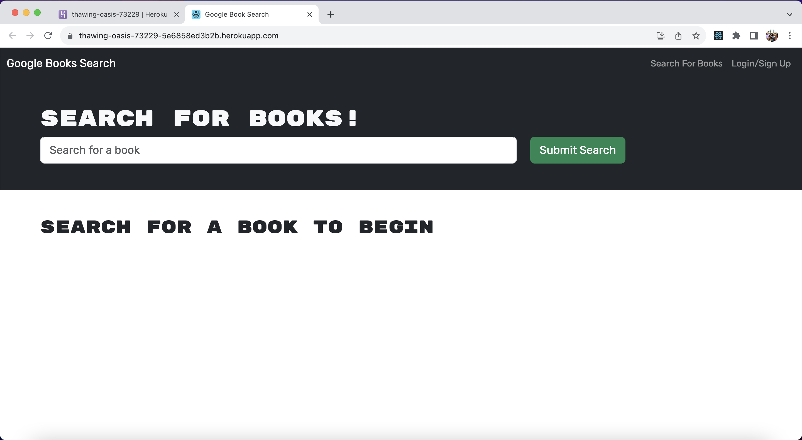

# 21 MERN: Book Search Engine

## The Task

The assignment this week was to refactor starter code of a fully app built with a RESTful API to be a GRAPHQL API built with Apollo Server. The front-end is built with react and the back-end with MongoDB and Node.js/Express.js. 

To complete the assignment, the next modifications were made:

1. Set up an Apollo Server to use GraphQL queries and mutations to fetch and modify data, replacing the existing RESTful API.

2. Modify the existing authentication middleware so that it works in the context of a GraphQL API.

3. Create an Apollo Provider so that requests can communicate with an Apollo Server.


## Given User Story

```md
AS AN avid reader
I WANT to search for new books to read
SO THAT I can keep a list of books to purchase
```

## Application

The following image shows the application deployed in Heroku: 




## Heroku and GitHub URLs

* [Heroku](https://thawing-oasis-73229-5e6858ed3b2b.herokuapp.com/)

* [GitHub](https://github.com/MariaFernandaMarroquin/book-search-engine)

---
© 2023 edX Boot Camps LLC. Confidential and Proprietary. All Rights Reserved.
